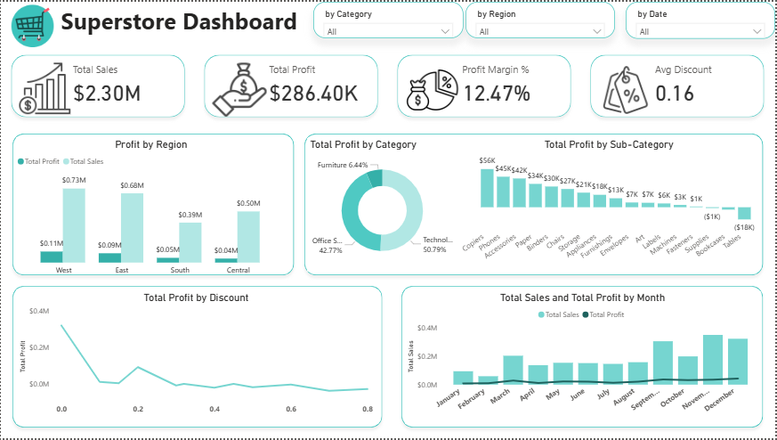

# 📊 Sales & Profit Analysis Dashboard

## 📸 Dashboard Preview

---

## 📝 Project Overview

**The Business Problem:** The client, a retail store owner, observed a critical issue: while sales revenue remains strong, the **overall profit margin is declining**. The client requested a root-cause analysis to understand why high sales are not translating into expected profits and to identify specific areas (regions, products, or strategies) causing this leakage.

**The Goal:** To build an interactive Power BI dashboard that analyzes sales data up to 2017, providing actionable insights into profitability drivers and offering data-backed recommendations to optimize the pricing and product strategy.

---

## 🗂️ Data Source & Preparation

The analysis is based on the `Superstore` dataset.
* **Format:** Excel File (`.xlsx`)
* **Dimensions:** The dataset includes granularity down to the Order ID level.
* **Key Columns:** `Order Date`, `Region`, `Category`, `Sub-Category`, `Sales`, `Quantity`, `Discount`, `Profit`.

**Data Processing:**
* Connected the raw Excel data to Power BI.
* Performed data quality checks and type transformations in Power Query.
* Created calculated measures using **DAX** for key metrics (Profit Margin %, Avg Discount, etc.).

---

## 🔍 Dashboard Features

The dashboard is designed for high-level monitoring and deep-dive analysis:

* **KPI Banner:** Displays Total Sales ($2.30M), Total Profit ($286.4K), Profit Margin (12.47%), and Average Discount (0.16).
* **Interactive Slicers:** Filtering by `Category`, `Region`, and `Date` allows for dynamic exploration.
* **Visualizations:**
    * **Profit by Region:** Identifies geographical performance gaps.
    * **Profit by Sub-Category:** Pinpoints specific products dragging down margins.
    * **Discount vs. Profit Analysis:** A line chart revealing the correlation between discount rates and profitability.
    * **Monthly Trend:** A combination chart showing Sales vs. Profit over time to identify seasonal patterns.

---

## 💡 Key Business Insights

After analyzing the data, the following root causes for the profit decline were identified:

### 1. The "Central" Region Trap
While the **Central Region** generates healthy revenue ($0.50M, ranking 3rd), it is the **lowest performing region in terms of profit** ($39.7K). This indicates high operational costs or excessive discounting in this specific geography.

### 2. Category Performance & The Furniture Issue
* **Profitable Categories:** `Technology` (50.79% profit contribution) and `Office Supplies` (42.77%) are performing well.
* **The Problem Child:** `Furniture` brings in high sales ($742K) but contributes only **6.44%** to the total profit.

### 3. Product-Level Losses
Drilling down into the `Furniture` category reveals that specific sub-categories are operating at a net loss:
* **Tables:** Net Loss of **-$17,725**.
* **Bookcases:** Net Loss of **-$3,472**.
These products are actively eroding the profits made by other items.

### 4. Discount Strategy Failure
There is a strong negative correlation between discount depth and profitability. Analysis shows that **discounts exceeding 20% (0.2)** result in a sharp decline in profit. Additionally, peak sales months (Nov, Dec, Sept) show disproportionately low profits, suggesting "over-discounting" during holiday seasons.

---

## 🚀 Strategic Recommendations

Based on the insights above, the following actions are recommended to the client:

1.  **Revamp the Furniture Strategy:**
    * Conduct a pricing review for **Tables** and **Bookcases**.
    * Consider discontinuing the most unprofitable SKUs in the Central Region or renegotiating shipping costs for these bulky items.
2.  **Optimize Discounting:**
    * Implement a **"Discount Cap"** policy. Discounts above 20% should require managerial approval.
    * Restructure holiday promotions (Nov/Dec) to focus on bundling rather than deep price cuts to protect margins.
3.  **Regional Focus:**
    * Investigate the Central Region's cost structure. If shipping is the issue, consider adjusting the free-shipping threshold for this zone.

---

## 📞 Contact

**Created by:** [Engy Saeed]  
**Role:** Data Analyst  

* **LinkedIn:** [https://www.linkedin.com/in/engy-saeed2003/](https://www.linkedin.com/in/engy-saeed2003/)
* **Email:** engysead498@gmail.com
